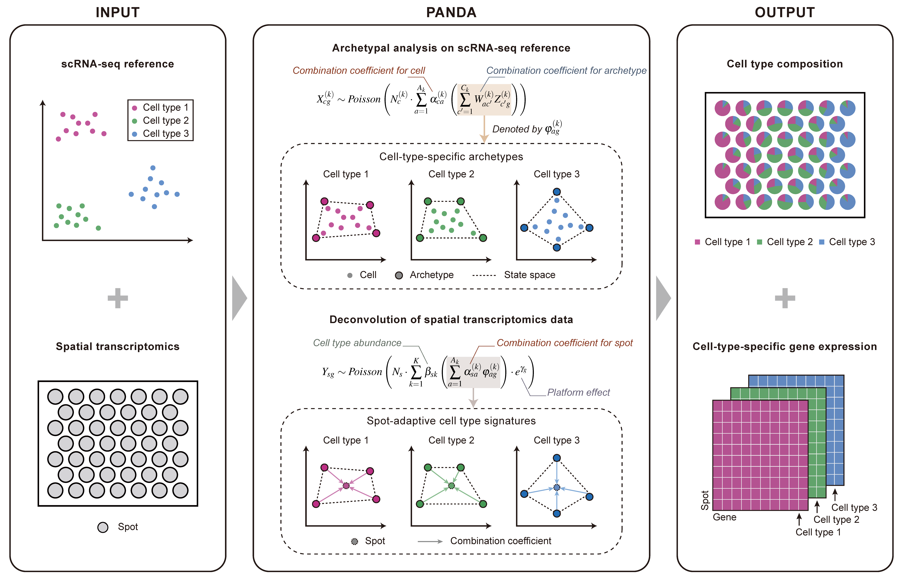

<!-- README.md is generated from README.Rmd. Please edit that file -->

# PANDA

<!-- badges: start -->
<!-- badges: end -->

R package supporting the paper “**Dual decoding of cell types and gene
expression in spatial transcriptomics with PANDA**”.

PANDA is a probabilistic-based deconvolution method capable of
simultaneously estimating cell type proportions and cell-type-specific
gene expression for spatial transcriptomics data. Its unique feature
lies in addressing variation within the same cell type during
deconvolution, achieved through the integration of archetypal analysis.
PANDA requires the gene expression count matrix along with cell type
labels from the scRNA-seq reference, as well as the gene expression
count matrix from the spatial transcriptomics data. The method involves
two key steps. Firstly, PANDA employs archetypal analysis on scRNA-seq
reference data to infer cell-type-specific archetypes, providing a
comprehensive characterization of the state space for each cell type.
Subsequently, PANDA performs deconvolution on spatial transcriptomics
data to deliver accurate estimates of cell type proportions and
cell-type-specific gene expression.



## Installation

The PANDA package has the following R-package dependencies: Seurat,
doParallel, foreach, parallel, umap, ggplot2.

The experiments implemented in the paper are based on Seurat v4.3.0,
which can be installed as follows:

``` r
install.packages('remotes')
remotes::install_version(package = 'Seurat', version = package_version('4.3.0'))
```

All other R-package dependencies can be installed via
`install.packages`.

After installing all dependencies, you can install the development
version of PANDA as follows:

``` r
install.packages("devtools")
devtools::install_github("Zhangxf-ccnu/PANDA")
```

## Usage

This is a basic example which shows you how to use PANDA for
deconvolution.

**Load package**

``` r
library(PANDA)
```

**Load datasets**

-   sc_counts: A matrix of the raw count expression in the scRNA-seq
    reference (cell x gene).
-   sc_labels: A vector of the corresponding cell type labels in the
    scRNA-seq reference.
-   st_counts: A matrix of the raw count expression in the spatial
    transcriptomics data (spot x gene).

**Perform archetypal analysis on the scRNA-seq reference**

``` r
sc_results <- sc_train(sc_counts, sc_labels, n_archetypes_vec = 10)
```

**Perform deconvolution on the spatial transcriptomics data**

``` r
st_results <- st_train(st_counts, sc_results = sc_results)
```

**Extract results**

The cell type proportions for spots can be extracted by

``` r
proportion <- st_results$proportion
```

The cell-type-specific gene expression can be extracted by

``` r
expression <- st_results$mu
```

## Tutorial

A tutorial with examples of the usage of PANDA is available at:
[PANDA-examples.html](https://github.com/Zhangxf-ccnu/PANDA-examples).

## Contact

Please do not hesitate to contact Mr. Meng-Guo Wang
(<mengguowang@mails.ccnu.edu.cn>) or Dr. Xiao-Fei Zhang
(<zhangxf@ccnu.edu.cn>) to seek any clarifications regarding any
contents or operation of the archive.
